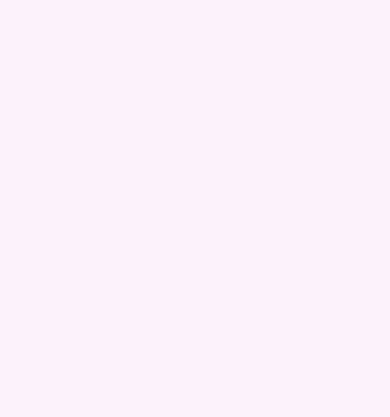

<div align="center">


**Adorable Live2D characters that live on your web pages.**

<p>
  <a href="https://www.npmjs.com/package/moe-widget"></a>
  <a href="https://github.com/meokisama/moe-widget/actions/workflows/ci.yml"></a>
  <a href="./LICENSE"></a>
</p>

</div>

<p align="center"></p>

## Features

- **One install, no setup.** The Cubism Core and the WebGL shaders ship inside the package. No script tags, CDN files, or folders to copy.
- **Small until used.** Importing costs a few kilobytes. The Core and the Framework (about 110 kB gzipped) load when the first canvas mounts, as their own chunks. Nothing is drawn while the canvas is off screen.
- **SSR safe.** Works in Next.js and other server-rendered apps. The component is a client component, and importing on the server touches nothing browser-only.
- **Honest promises.** A missing or invalid model reaches `onError` instead of hanging. `motion()` resolves when the motion ends.
- **Safe to unmount.** Any number of canvases can come and go in any order, even while loading. StrictMode works.
- **Layouts that hold at any size.** Choose the part of the model to show and how to fit it, rather than tuning scale and position by eye.

## Install

```sh
npm install moe-widget
```

Needs React 18 or newer.

## Quick start

```tsx
import { Live2DCanvas } from "moe-widget";

export function Mascot() {
  return (
    <div style={{ width: 300, height: 400 }}>
      <Live2DCanvas model="/models/mao/Mao.model3.json" />
    </div>
  );
}
```

The canvas fills its parent, so give the parent a size. With only a model, it idles, follows the pointer and reacts to taps.

## Documentation

- [Guide](./docs/guide.md): controlling the model, taps, lip sync, layout, server rendering.
- [API](./docs/api.md): every prop, the handle, and the exported types.
- [Architecture](./docs/architecture.md): how the library is built, and how to work on it.

## License

The code in `src/` is under the [MIT license](./LICENSE). The package also includes Live2D Cubism components under Live2D's own licenses. See [NOTICE.md](./NOTICE.md).

> Those licenses are free for individuals and small businesses. A business with annual revenue of 10 million JPY or more needs a [Cubism SDK Release License](https://www.live2d.com/en/sdk/license/) to publish content that uses them.

Models belong to their authors and follow their own terms.
